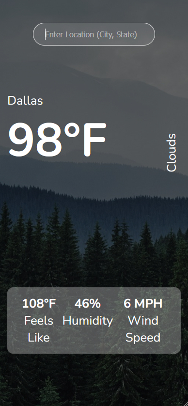

# Description

This is my first project using React. It's a simple weather app that allows the user to see an 
overview of the current weather conditions in any area in the world. I know everybody creates a weather 
app at some point, but I feel like I have a basic understanding of how to use libraries and how they can 
make development more efficient; and this project represents a transition point for me in order to become 
a better developer.

## Screenshot

  
Optimized for mobile screens

  

## Demo

https://ccavanaugh18.github.io/weather-app/

In order to search correctly, the format should be (city name, state name). Due to the OpenWeather API, 
you must enter the full state name.
